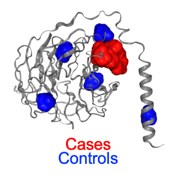

# 3D-CLUMP



3D-CLUMP (3D-CLustering by Mutation Position) is an unsupervised clustering of amino acid residue positions where variants occur, without any prior knowledge of their functional importance, in 3D space.  This code is based on the [original CLUMP](https://www.ncbi.nlm.nih.gov/pmc/articles/PMC6354780/).

This is a program developed collaboratively by the laboratories of Dr. Tychele N. Turner at Washington University in St. Louis [http://turnerlab.wustl.edu/](http://turnerlab.wustl.edu/) and Dr. Rachel Karchin at Johns Hopkins University [https://karchinlab.org/](https://karchinlab.org/).

Current Maintainers:
Jeffrey Ng, Dr. Turner Lab, jeffrey.ng@wustl.edu

Yilin Chen, Dr. Karchin Lab, yilinc5@stanford.edu

## Citation
If you use 3D-CLUMP in your research, please cite:
** Our paper, hopefully! **


## 3D-CLUMP Docker image can be found here:
```
docker pull jng2/testme:clump3d_slim_env
```
Or by building the env.yaml file found in the dockerfile folder.


## USAGE:

```
python 3D-CLUMP.py -f inputfile -p protein_lengths -s structurepath
```
OPTIONS:
-a allele_frequency(Default=1)
   Remove Mutations Greater than an allele frequency threshold. Default includes every variant.
   
-c inputfile_controls
   Input file for the controls. A set of controls is required to get a statistical significance with the clump score
 

-z number_of_permutations 
   The number of permutations you want to perform for significance testing. 


-m minimum_number_of_mutations(Default=5) 
   The minimum number of mutations in a gene in order to perform CLUMP.

-n normalize(Default=No)
   Do you want to normalize based on protein length. Normalization was not used in the published results.
   
-t Output Column Titles


Permutation CLUMP works best when the input file only contains one gene.

The input file and the control input file are in the same format:


* Column 1: GENE_HUGO_ID 	      Required
* Column 2: PROTEIN_ID 	       Required: Must match Protein Id's provided in the protein length file
* Column 3: STUDY_NAME 	       Used as a column placeholder in CLUMP scripts (Can use NA if unavailable)
* Column 4: AMINO_ACID_POSITION  Required: Amino Acid position of the variant
* Column 5: CHROM 	       Used as a column placeholder in CLUMP scripts (Can use NA if unavailable)
* Column 6: POSITION 	       Used as a column placeholder in CLUMP scripts (Can use NA if unavailable)
* Column 7: REF Allele	       Used as a column placeholder in CLUMP scripts (Can use NA if unavailable)
* Column 8: ALT Allele	       Used as a column placeholder in CLUMP scripts (Can use NA if unavailable)
* Column 9: ALLELE_FREQUENCY     Required column. Need to add a value between 0 and 1. If you do not know it can just be 0 unless you are actually using the allele frequency feature of CLUMP.
* Column 10:DOMAIN	       Optional column (can be NA)

The protein length file is in the format:
```PROTEIN_ID LENGTH```

You can find an updated protein length file: protein.2.length.2023.txt

## Example runs

When running, please make ensure that ```/opt/conda/envs/snakemake/bin``` is in the PATH.  It is set by default, but if your cluster overwrites the Docker image environment pathways, this will need to be either added to the path or by activating the ```snakemake``` conda environment.  

#### Python docker run:
```
docker run  -v "/path/to/github_repo:/runme" -v "/path/to/pdb/files:/proteins" jng2/testme:clump3d_slim_env  python3 /runme/3D-CLUMP.py -s /proteins/ -f /runme/mutation_input -p /runme/protein.2.length.2023.txt -c /runme/control_input -m 5 -z 1000 
```

Output:
```
SMARCA2	NP_001276325	ndd_out	2.7132983495149348	1.0	0.0	0.8383716972664214	3.5516700467813562
```

Running high throughput CLUMP using snakemake:
 

#### Snakemake CLUMP

Local

```
snakemake -s case.control.snake --cores 2
```

Submit to cluster

```
snakemake --cluster 'your cluster information' -j 100 -w 30 -k -s case.control.snake
```
